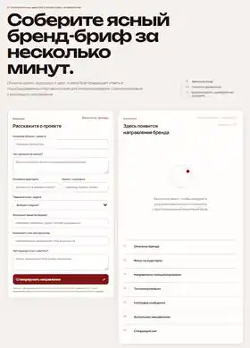

# AI Brand Brief

A bilingual AI-assisted branding product that turns scattered business context into a structured starter brief for positioning, tone of voice and visual direction.

**Live demo:** https://ai-brand-brief.vercel.app/  
**Russian version:** https://ai-brand-brief.vercel.app/ru/

## Preview



## Portfolio snapshot

**Role:** Product concept · UX/UI · prompt architecture · front-end · serverless integration · deployment  
**Status:** MVP v0.4 — deployed  
**Format:** EN / RU · responsive web app  
**Core idea:** turn an unclear client brief into an editable strategic starting point

## Problem

Branding projects often begin with fragmented client input: goals, audience, competitors and visual preferences arrive as separate notes instead of a usable brief. That creates extra clarification work before design can even begin.

## Solution

AI Brand Brief structures that raw context into seven practical sections:

- brand summary
- audience focus
- positioning direction
- tone of voice
- three key messages
- visual direction
- recommended next step

The result can be edited directly in the interface, copied as formatted text and saved as PDF through the browser print workflow.

## Product flow

```text
Questionnaire
    ↓
Language-aware browser UI
    ↓
POST /api/generate
    ↓
Serverless generation endpoint
    ↓
Validated structured brief
    ↓
Editable result
    ↓
Copy / Save PDF
```

When AI credentials are unavailable, the product automatically switches to a deterministic local fallback instead of breaking the experience.

## Key product decisions

### 1. Safe server-side AI architecture

The API credential is never exposed in browser-visible JavaScript. The interface talks to a serverless endpoint, while credentials are expected only as deployment environment variables.

### 2. Graceful fallback

A public portfolio demo should remain testable without a paid API account. The fallback keeps the full user flow working and clearly identifies when it was used.

### 3. Editable output

Generated strategy is treated as a draft, not a final answer. Users can refine sections before copying or exporting the result.

### 4. Lightweight PDF export

Instead of adding a heavy PDF dependency, the MVP uses print-specific CSS and the browser's native Save as PDF workflow.

### 5. Shared bilingual logic

English and Russian interfaces reuse the same product logic and endpoint. Language is passed through the generation flow rather than maintaining two separate applications.

## What I built

- Product concept and use case
- Questionnaire information architecture
- Editorial UI direction
- Responsive front-end
- EN / RU product flow
- Structured generation contract
- Serverless API route
- Output validation
- deterministic fallback logic
- direct result editing
- clipboard export
- print / PDF layout
- Vercel deployment

## Stack

- HTML5
- CSS3
- Vanilla JavaScript
- Browser Clipboard API
- ContentEditable API
- Print / PDF CSS
- Serverless JavaScript API route
- environment variables for secret management
- Git / GitHub
- Vercel

## What I learned

This project moved my branding experience into product-building practice. The main technical lessons were separating browser and server responsibilities, designing predictable structured output, handling external-service failure, managing secrets correctly and building one product flow for two languages.

It also reinforced a product principle I want to keep using: AI should support a workflow, not become the workflow itself. The interface still needs to be useful, understandable and recover gracefully when the model layer is unavailable.

## Current MVP

**MVP v0.4 — bilingual deployed portfolio prototype**

Included now:

- EN / RU interface
- responsive layout
- questionnaire → structured output flow
- AI-ready server endpoint
- safe deterministic fallback
- editable generated sections
- copy to clipboard
- browser PDF export
- deployed live demo

## Next iterations

- local brief history
- regenerate individual sections
- stronger schema-constrained model output
- lightweight abuse protection
- accessibility testing
- optional private AI-enabled production deployment

## Related work

**Job Search CRM:** https://job-search-crm-psi.vercel.app/  
A second AI-builder portfolio project focused on local-first state, pipeline management and transparent rule-based vacancy matching.

**Portfolio:** https://anostosio.ru/

---

Created by **Anostosio°**  
Graphic Design · Branding · Advertising · AI-assisted Product Building