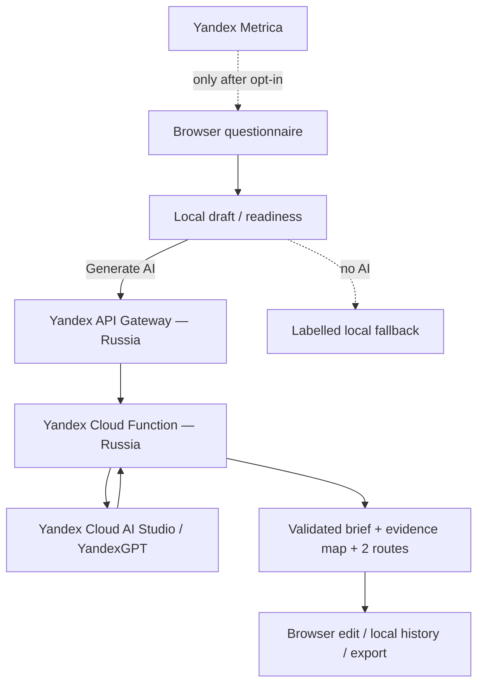

# Brand Brief Studio

A bilingual, evidence-aware AI workspace for turning real project context into an editable working brand brief without presenting model assumptions as research.

**Brand:** Anostosio° / Product Lab  
**Migration target:** `https://brief.anostosio.ru/`  
**Status of this branch:** privacy/data-architecture migration — **not yet production cutover**

> The current public Vercel/Groq deployment is legacy until the Russian Yandex Cloud target is provisioned and verified. This branch must not be represented as already deployed, and it must not be merged into production until the cutover checklist is complete.

## Product flow

The product keeps the existing workflow:

1. Complete a structured brand questionnaire.
2. Run a local readiness diagnostic.
3. Generate a structured AI draft or use an explicitly labelled local fallback.
4. Review evidence status and alternative strategic routes.
5. Edit, reopen recent work, copy, export JSON or save PDF.

The evidence system distinguishes:

| Status | Meaning |
| --- | --- |
| Grounded | Directly supported by supplied fields |
| Mixed | Supplied facts plus professional interpretation |
| Hypothesis | A proposal that needs testing |
| Needs validation | Evidence is missing or contradictory |

## Target privacy architecture



### Local browser data

- questionnaire draft is stored in Local Storage;
- up to eight recent briefs per language are stored locally;
- no user account is required;
- the target architecture has no application database of briefs;
- the UI includes **Delete local data** for product draft/history storage.

### Server / AI processing

AI generation sends the validated questionnaire only when the user explicitly starts generation.

Target backend:

- Yandex API Gateway;
- Yandex Cloud Functions, Node.js 22;
- Yandex Cloud AI Studio;
- explicit structured output schema;
- server-side output validation;
- AI request logging requested off via `x-data-logging-enabled: false`;
- function service-account IAM token supplied by runtime context;
- no permanent AI API key in browser/repository.

### Technical identifiers

The network layer necessarily sees technical request metadata including client IP. The application converts the client address into an HMAC-derived in-memory rate-limit key and does not intentionally put raw IP, questionnaire text or generated output into Brand Brief Studio application logs.

This does **not** mean platform-level logs contain no request metadata; their actual production retention/access must be verified before final privacy wording is published.

### Analytics

Yandex Metrica remains optional:

- tag loads only after explicit opt-in;
- decline is supported;
- preference can be reopened later;
- **Webvisor / Session Replay is disabled**;
- withdrawal disables future counter activity and performs best-effort cleanup of accessible first-party Metrica browser identifiers.

Dashboard-side Metrica settings still require a production review.

## Legacy path and fail-closed behavior

The previous AI flow was:

```text
browser -> Vercel function -> Groq
```

That is not the target public personal-data architecture.

In this migration branch, the default Vercel `api/generate.js` handler intentionally returns `503 MIGRATION_REQUIRED`. The actual generation adapter is `functions/generate.js` for Yandex Cloud Functions.

This prevents an accidental redeploy from silently recreating the foreign AI path after the migration code is merged.

## Files

```text
api/generate.js                    generation core + fail-closed legacy handler
functions/generate.js              Yandex Cloud Functions HTTP adapter
lib/brief-core.js                  validation, readiness, trust and local fallback
app.js                             browser workflow and local history
analytics.js                       consent-gated Metrica, Webvisor disabled
privacy-controls.js                delete local draft/history data
index.html                         English interface
ru/index.html                      Russian interface
privacy/index.html                 English migration-draft privacy page
ru/privacy/index.html              Russian migration-draft privacy page
PRIVACY-DATA-MAP.md                actual/target data-flow inventory
LEGAL-OPERATOR-CHECKLIST.md        code vs operator/Roskomnadzor actions
SECURITY-PRIVACY-NOTES.md          privacy/security engineering invariants
deploy/yandex/                     target deployment template and runbook
test/                              product/provider/privacy regression tests
```

## Privacy documentation

Read these together:

- [`PRIVACY-DATA-MAP.md`](PRIVACY-DATA-MAP.md)
- [`LEGAL-OPERATOR-CHECKLIST.md`](LEGAL-OPERATOR-CHECKLIST.md)
- [`SECURITY-PRIVACY-NOTES.md`](SECURITY-PRIVACY-NOTES.md)
- [`deploy/yandex/README.md`](deploy/yandex/README.md)

They intentionally do **not** claim that the project is compliant merely because code was changed.

Final production publication is blocked until:

- the real personal-data operator/contact is supplied;
- applicable Roskomnadzor actions are completed/documented;
- Russian Yandex Cloud resources, region, logging and access are verified;
- live Yandex model quality and structured output are tested;
- Metrica dashboard/settings are verified;
- Google Fonts are replaced by licensed self-hosted WOFF2 assets;
- a live network trace proves the final path has no Groq/Vercel AI, Google Fonts or Webvisor dependency;
- migration-draft privacy wording is replaced by verified final wording.

## Fonts migration blocker

Manrope and Unbounded are licensed under SIL Open Font License 1.1 and may be self-hosted subject to the license terms.

The migration branch temporarily retains Google Fonts links so previews do not render with missing font assets. **This must be removed before production cutover.**

Use official upstream distributions only and preserve OFL notices:

- Manrope: https://github.com/google/fonts/tree/main/ofl/manrope
- Unbounded: https://github.com/google/fonts/tree/main/ofl/unbounded

After local WOFF2 files are added, remove `fonts.googleapis.com` and `fonts.gstatic.com` from HTML and CSP.

## Development

```bash
npm install
npm run check
npm test
```

Node.js 22+ is the target runtime.

Local-only environment placeholders are documented in `.env.example`. Production Yandex Cloud Functions should use the attached service-account IAM token from the invocation context rather than a stored long-lived AI key.

## Reliability / safety invariants

- validation in browser and server core;
- 24 KB request-body limit;
- request timeout;
- pseudonymous per-client in-memory rate limiting;
- strict output schema and post-generation validation;
- one retry for invalid structured model output;
- no questionnaire/output in application log calls;
- request IDs for diagnostics;
- local fallback remains clearly labelled as non-AI;
- no HTML injection from generated text;
- restrictive deployment security headers required;
- privacy regression tests;
- fail-closed legacy AI path.

## Production deployment

See [`deploy/yandex/README.md`](deploy/yandex/README.md).

The recommended public domain is `brief.anostosio.ru`, served directly from the Russian Yandex Cloud target. Only after this is live and verified should the old `ai-brand-brief.vercel.app` deployment be redirected or retired.

---

Created by **Anostosio° / Product Lab**  
Graphic Design · Branding · Advertising · AI-assisted Product Building
