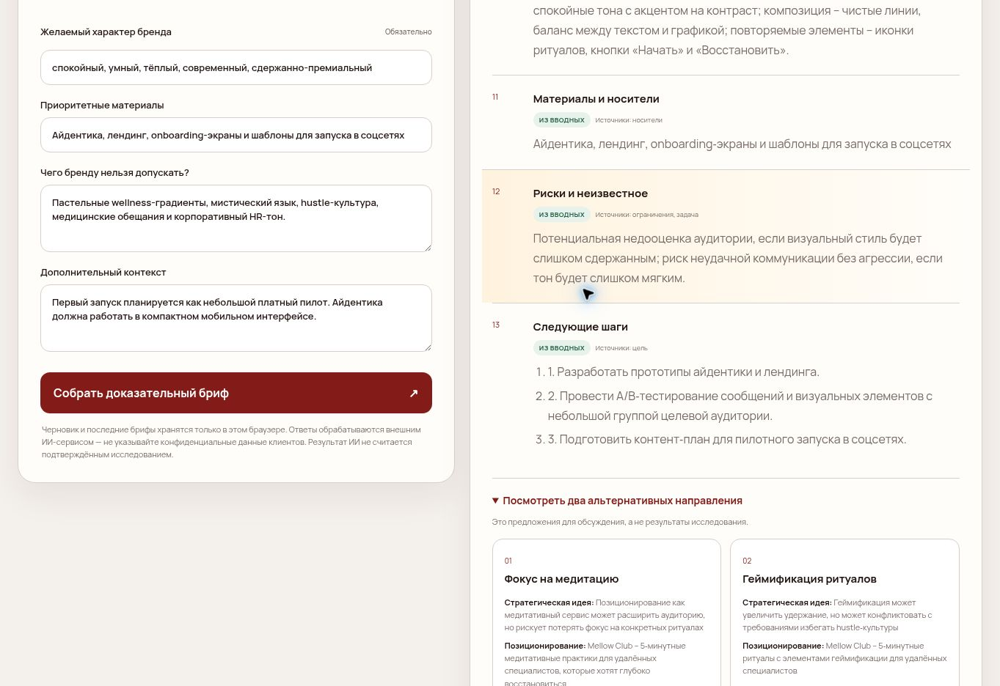
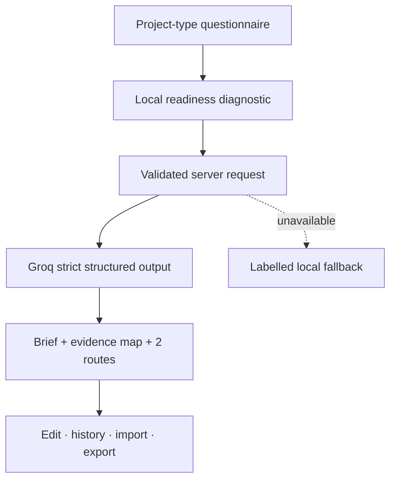

# Brand Brief Studio

A bilingual, AI-assisted workspace for turning real project context into an editable brand brief—without presenting model assumptions as market research.




**Live product:** https://ai-brand-brief.vercel.app/

**Russian version:** https://ai-brand-brief.vercel.app/ru/

## Portfolio snapshot

**Role:** product concept · brand methodology · UX/UI · front-end · serverless integration · testing · deployment

**Status:** v1.2 · Trust & Quality

**Format:** EN / RU · responsive web application

**Core idea:** help a designer or client team move from fragmented inputs to a reviewable working document

## The problem

Brand projects often start with scattered notes, visual preferences and unverified assumptions. A short AI prompt can make that material sound polished, but it can also hide what is missing, invent confidence and produce a document that is difficult to use in real work.

## The solution

Brand Brief Studio asks for the context that a serious first brief needs:

- business offer and project challenge
- primary goal and market
- audience, needs and barriers
- competitors and alternatives
- defensible difference and proof
- personality, deliverables and constraints

It turns those inputs into 13 editable sections, including positioning, value proposition, messaging, visual direction, risks and ordered next steps. Every section also carries a visible evidence status—grounded, mixed, hypothesis or needs validation—plus the questionnaire fields that support it.

Before generation, a local readiness diagnostic scores five dimensions: foundation, audience tension, competitive difference, evidence and scope. This improves the input without spending an AI request.

## Product flow



If AI generation is unavailable, the interface preserves the answers and offers two explicit choices: retry or create a clearly labelled local structured draft. It never disguises a template as a successful AI response.

## Key product decisions

### Evidence-aware output

The prompt forbids invented research, channels, deliverables, sample sizes, market claims and proof. The data contract requires an evidence status, source-field list and uncertainty note for every section. The output also includes a dedicated “Risks and unknowns” section.

| Status | Meaning |
| --- | --- |
| Grounded | Directly supported by supplied fields |
| Mixed | Supplied facts plus professional interpretation |
| Hypothesis | A strategic or creative proposal to test |
| Needs validation | Evidence is missing or contradictory |

### Project-aware generation

The questionnaire supports new brands, rebrands, campaigns, personal brands, digital products and packaging. The selected type changes the guidance and becomes part of the generation context.

### Alternative routes

Each generation includes two deliberately different strategic routes with positioning, tone, visual principle, advantage and risk. They are clearly presented as proposals rather than research conclusions.

### Schema-constrained generation

The server uses Structured Outputs with a strict JSON Schema, then validates the response again before returning it to the browser.

### Honest failure states

API errors, timeouts and unavailable credentials produce a recoverable interface state. The user’s local draft remains intact and the fallback is always labelled as non-AI.

### Local-first continuity

Questionnaire drafts and the eight most recent briefs are stored in the current browser. No account is required, and recent work can be reopened and edited.

Versioned JSON export and import make projects portable without introducing accounts or a database.

### Client-ready exports

The product supports formatted clipboard output, a versioned machine-readable JSON format and a print-optimized A4 document with a cover, readiness score, evidence labels and alternative directions.

## Reliability and safety

- API credentials remain server-side
- required-field and length validation in browser and server
- request body size limit
- request timeout, per-IP guard and per-instance global quota protection
- strict schema-constrained model output
- output validation before rendering
- one automatic retry if a model response fails local quality validation
- request ID, duration and outcome logging without questionnaire content
- explicit warning against submitting confidential client information
- no HTML injection from generated content
- security headers and restrictive Content Security Policy
- reduced-motion and keyboard-focus support
- automated core tests and GitHub Actions checks

The in-memory guards are intentionally lightweight for this portfolio deployment. A production multi-instance service should use a shared rate-limit store or the hosting provider’s firewall.

Questionnaire answers submitted for AI generation are processed by Groq. The public demo should be used with fictional or non-confidential project information.

## Stack

- semantic HTML5
- responsive CSS and print styles
- vanilla JavaScript ES modules
- Local Storage, Clipboard and Blob APIs
- Vercel serverless function
- Groq Chat Completions API with Structured Outputs
- Node.js built-in test runner
- GitHub Actions
- Vercel

## Search and brand surface

The deployment includes a custom `B°` favicon, web app manifest, canonical URLs, EN/RU hreflang links, Open Graph metadata, `robots.txt` and a bilingual XML sitemap. The site is ready for ownership verification in Google Search Console and for a Yandex Metrica tag once account-specific identifiers are issued.

## Quality checks

The dependency-free test suite covers sanitization, required inputs, readiness scoring, local fallback generation, evidence metadata, alternatives, provider parsing, upstream error classification and the bilingual HTML interaction contract.

## Run locally

The static interface works with any local web server. AI generation requires a Vercel-compatible serverless environment and the variables from `.env.example`.

```bash
npm install
npm run check
npm test
```

Environment variables:

```text
GROQ_API_KEY=your_server_side_key_here
GROQ_MODEL=openai/gpt-oss-20b
```

## Project structure

```text
api/generate.js          server-side generation, retry, limits and safe logging
lib/brief-core.js        shared validation, readiness, trust and fallback logic
test/                    dependency-free core tests
.github/workflows/       automated quality checks
index.html               English interface
ru/index.html            Russian interface
app.js                   browser state and interaction layer
style.css                responsive and print design system
vercel.json              deployment security headers
```

## What I learned

This project connects my branding practice with product-building. The central product decision was to make uncertainty visible instead of polishing it away. A reliable AI product needs good inputs, evidence-aware output, predictable contracts, recoverable errors and a useful workflow before and after generation.

## Related work

**Job Search CRM:** https://job-search-crm-psi.vercel.app/  
**Portfolio:** https://anostosio.ru/

---

Created by **Anostosio°**

Graphic Design · Branding · Advertising · AI-assisted Product Building
